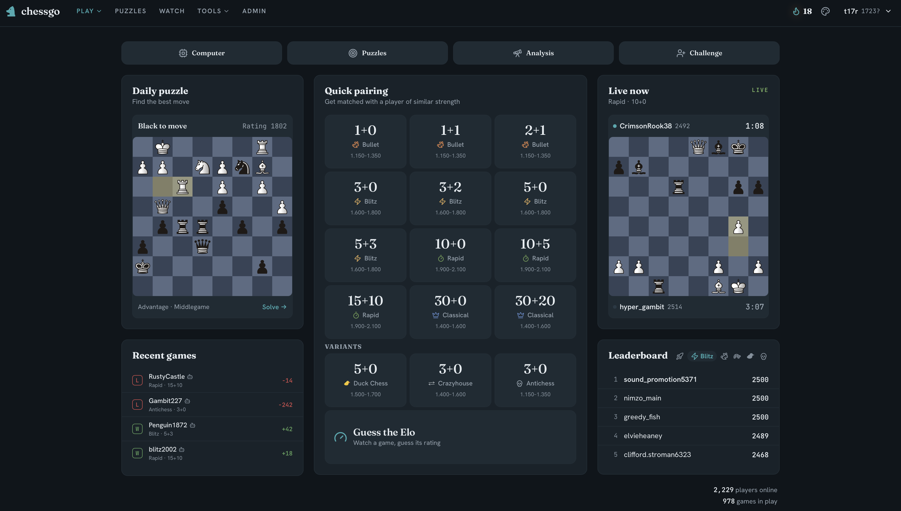

# chessgo

A production chess platform and a strong chess engine, in one repo. The site runs
at [chessgo.timanthonyalexander.de](https://chessgo.timanthonyalexander.de): play
**vs other humans** with live matchmaking and server clocks, **vs the AI**, solve
**puzzles**, and play three **variants** (Chess960, Crazyhouse, Duck Chess).

The engine is **zugzwang**, a from-scratch C++17 NNUE engine — every rule, the
move generator, the evaluation, and the search written from scratch. It serves all
of the site's rules and all of its AI over a stateless HTTP API, and speaks UCI
for any chess GUI.



## The engine: zugzwang

A perspective-relative NNUE (a 512-wide feature transformer with 16 king-buckets
and Stockfish-style full-threat inputs, incremental int16 accumulator, native
SIMD kernels) over a PVS alpha-beta search: iterative deepening, aspiration
windows, a clustered transposition table, late move reductions, SEE-filtered
captures and quiets, null-move pruning, reverse futility and late-move pruning,
singular extensions, correction history, and continuation history — with magic
bitboard move generation, and a concurrent search-context pool for the web
service. It falls back to a hand-crafted eval when no net is loaded.

Strength was built by self-play **SPRT** — a change plays the previous version
until the test decides it's an improvement or rejects it; nothing ships on a
hunch. zugzwang is **materially stronger than the previous engine on the same
net** and sits within ~150–200 Elo of full-strength Stockfish at equal movetime.
No point rating is quoted.

zugzwang succeeded **gomachine**, the original from-scratch Go engine, in the
2026-07 cutover (it won the head-to-head on the same net). gomachine is now an
archived reference — its docs live under `gomachine/` — while its realtime **hub**
stays on as the live-game infrastructure.

### Build & use

```sh
cd zugzwang && make        # arch-detected native build → ./zugzwang
./zugzwang serve           # HTTP engine API on :6476
./zugzwang                 # UCI, for any GUI (Arena, Cute Chess, lichess-bot)
```

Point `net.nnue` at the evaluation net (symlinked to the prod net in this repo);
without it the engine runs on its hand-crafted eval. See `zugzwang/CLAUDE.md` for
engine internals.

## The platform

No account needed to play — bot games, puzzles, and casual live games all work as
a guest. An account adds ratings, required for rated games.

- **Live games** — rating-proximity matchmaking (the gap widens with wait, capped
  at 400), server clocks that start Lichess-style, chat, draw/takeback offers,
  resign, premoves, reconnect and resume. A rating-matched bot fills in if no
  human turns up.
- **Ratings** — Glicko-2 tracked separately for bullet, blitz, rapid, and
  classical, plus an isolated puzzle rating.
- **Play the computer** — a 700–2900 Elo strength slider, choose your color,
  untimed, with a live eval bar and premoves. Unrated.
- **Puzzles** — Puzzle-Rush-style timed sessions on Lichess-seeded, rating-matched
  tactics; theme filter; server-validated solutions; a deterministic daily puzzle.
- **Analysis board** — streaming eval, best-move arrow, principal variation, a
  branching move tree, full-game review with per-player accuracy, an opening
  explorer, and an optional Stockfish second opinion.
- **Variants** — Chess960, Crazyhouse, and Duck Chess.
- **Also** — Guess-the-Elo, a position editor, watch/spectate the strongest live
  games, profiles, leaderboards, a daily-activity streak, and an admin panel with
  anti-cheat review.

### Run it

Five services plus MySQL: the PHP backend (BaseAPI, `:6464`), the React frontend
(Vite + Bun, `:6465`), the **zugzwang engine** (`:6476`), the realtime **hub**
(`gomachine hub`, `:6467`), and — for now — the legacy gomachine engine (`:6466`).

```sh
./mason serve --screen          # PHP API on :6464
cd zugzwang && ./zugzwang serve  # engine on :6476
WS_TICKET_SECRET=… gomachine hub # hub on :6467
cd frontend && bun run dev       # frontend on :6465
```

Open <http://127.0.0.1:6465>. Full setup and deployment are in
[docs/COMMANDS.md](docs/COMMANDS.md); the design is in [docs/SPEC.md](docs/SPEC.md)
and [docs/ARCHITECTURE.md](docs/ARCHITECTURE.md).

## Layout

- `zugzwang/` — the engine (C++): rules, movegen, search, NNUE, HTTP serve,
  variants. See [zugzwang/CLAUDE.md](zugzwang/CLAUDE.md).
- `app/` — PHP backend (BaseAPI); routes in `routes/api.php`.
- `frontend/` — React + Vite + TypeScript + MUI.
- `gomachine/` — the realtime hub (`internal/hub`) + the archived Go engine and
  its historical docs (`gomachine/docs/`, `gomachine/engine/docs/`).
- [CLAUDE.md](CLAUDE.md) — fast orientation for the whole codebase.
- [docs/tasks/](docs/tasks/) — the open + done backlog.

## License

GPLv3. See [LICENSE](LICENSE). Derivative work stays open under the same terms.
