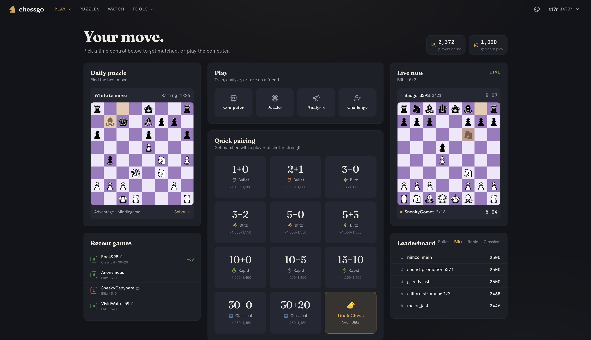

# chessgo

A chess website and a chess engine, both in this repo. The website runs in production at [chessgo.timanthonyalexander.de](https://chessgo.timanthonyalexander.de). The engine, `gomachine`, is a standalone Go program that plays around ~3750 CCRL Blitz and speaks UCI.

Every rule, the move generator, the evaluation, and the search are written from scratch in Go. No external chess library. The website calls the engine over HTTP and a WebSocket; the engine has no dependency on the website and runs on its own.

**Under the hood:** 768→512×2→1 SCReLU NNUE, perspective-relative, incremental int16 accumulator, archsimd AVX2/NEON kernels; Lazy SMP negamax alpha-beta, iterative deepening, aspiration windows, principal variation search (PVS), lock-free Hyatt-XOR transposition table with a static-eval cache; late move reductions (LMR), SEE-filtered captures, null-move pruning, reverse futility pruning (RFP), late move pruning (LMP), delta pruning, frontier futility, singular extensions with multicut, correction history; history and killer move ordering; king-proximity and passed-pawn-race eval terms in the hand-crafted fallback; magic bitboard (pin-aware, PGO-built) move generation, Zobrist hashing, repetition detection, opening book; 5-piece Syzygy (Fathom) DTZ root probing plus WDL tablebase probing inside the search; clock-aware time management.

## gomachine

One self-contained binary. Evaluation network and opening book are compiled in, so it runs from any directory with nothing else to download.

### Strength

**~3750 CCRL Blitz**, tested at full strength against a range of CCRL-rated engines.

Development uses self-play **SPRT** (sequential probability ratio test): a change plays the previous version until the test decides it is an improvement or it is rejected. Nothing ships on a hunch. Full method and every result with confidence intervals: [docs/ENGINE_STRENGTH.md](docs/ENGINE_STRENGTH.md).

### What's in it

- **Move generation**: bitboards + magic bitboards, verified against known perft node counts.
- **Evaluation**: `(768→512)×2→1` SCReLU NNUE trained on Stockfish-labelled positions, int16 incremental accumulator, hand-written AVX2/NEON SIMD inference. Falls back to a Texel-tuned hand-crafted eval if no net is loaded.
- **Search**: alpha-beta with SEE, null-move pruning, late move reductions, reverse futility and late-move pruning, aspiration windows, singular extensions, correction history, futility pruning.
- **Parallelism**: Lazy SMP over a lock-free transposition table, byte-identical to the serial search at one thread.
- **Endgames**: 5-piece Syzygy tablebases, probed at the root and inside the search (optional, not bundled).

Strength was built in SPRT-gated layers: search patches (~+250 Elo), Lazy SMP (~+97), Texel-tuned eval replacing the piece-square baseline (+101), Syzygy (+18 to +33 on endgame books), NNUE replacing the hand-crafted eval (+212), a wider net with SIMD (+101), then correction history / singular / futility (~+110 at fixed nodes).

The very top engines (~4000+ CCRL) are still ahead. Remaining levers, a wider network, more training data, SPSA tuning, are in the strength doc.

### Strength progression (0 → ~3750)

How it got here, chronologically. **Δ Elo** is the self-play SPRT gain of each step over the version before it, on the ruler noted — *fixed-nodes inflates eval changes, movetime is the honest one, and the endgame terms were measured on an endgame book so their whole-game effect is a fraction of the quoted number*. Self-play gains don't linearly sum, so **Cum.** is a guesstimate, not arithmetic. **≈ CCRL** is filled only where there's a real external measurement (†) and interpolated elsewhere; the baseline sits ~2800 because the early "~2400 vs Stockfish" read was on Stockfish's UCI_Elo scale, which runs ~390 below CCRL. The endpoint ~3750 is itself an estimate still owing a formal re-anchor.

| # | Step | Δ Elo (ruler) | Cum. | ≈ CCRL |
|---|------|---------------|:----:|:------:|
| 0 | **Foundations** — magic-bitboard movegen, make/unmake, Zobrist, perft; PeSTO tapered HCE; alpha-beta → negamax, iterative deepening, PVS, Hyatt-XOR TT, qsearch, MVV-LVA + killer/history ordering | baseline | 0 | ~2800 |
| 1 | SEE-filtered captures (qsearch + main search) | ~+70 self-play | +70 | |
| 2 | Delta pruning + aspiration windows | ~+50 self-play | +120 | |
| 3 | Reverse futility (RFP) + late move pruning (LMP) + late move reductions (LMR) | ~+90 self-play | +210 | |
| 4 | Null-move pruning | ~+40 self-play | +250 | ~3000 |
| 5 | **Lazy SMP** — lock-free TT, multi-thread search | +97 movetime | +347 | ~3050 |
| 6 | **Texel-tuned HCE** — joint Adam on WDL, PSQT tuned in (the HCE ceiling, done right) | +101 movetime | +448 | ~3110† |
| 7 | Syzygy 5-piece Fathom root-DTZ probing | +18.8 (EG book) | +456 | |
| 8 | WDL tablebase probing inside the search | +32.7 (EG book) | +466 | |
| 9 | KingProx — endgame king-proximity-to-passers eval term | +30.5 (EG book) | +474 | |
| 10 | PawnRace — knight-aware unstoppable-passer / race eval term | +17.4 (EG book) | +479 | ~3140 |
| 11 | **NNUE v4 (256-wide)**, non-incremental float — eval leaps but the accumulator is too slow (+172 fixed nodes, **−156 movetime**: the NPS wall) | ~0 net (movetime) | +479 | |
| 12 | + incremental **int16 accumulator** → NNUE ships and replaces HCE | +212 movetime | +691 | ~3270† |
| 13 | **NNUE v6 (512-wide)** — width is the lever, but a wash on a scalar build (+124 fixed nodes only) | ~0 (scalar movetime) | +691 | |
| 14 | + **archsimd** AVX2/NEON SIMD kernels (6.5×/4.16× eval) unlock v6 at movetime | +101 movetime | +792 | ~3300 |
| 15 | Correction history | +66.9 @ 40k nodes | +827 | |
| 16 | Singular extensions + multicut | +22.2 @ 40k nodes | +842 | |
| 17 | Frontier futility | +21.3 @ 40k nodes | +854 | |
| 18 | SEE / history late-leaf pruning retune (CaptSEE margin → 25) | +97 chain @ 40k | +884 | ~3450 |
| 19 | PGO build | +3% NPS | +889 | |
| 20 | Pin-aware legal movegen | +20% NPS | +904 | |
| 21 | TT static-eval cache | +14.8 movetime | +919 | ~3500 |
| — | **Anchor (2026-07-01): floor measured >3400** — 100W–0L vs a ~3400 engine | *measurement* | — | **>3400†** |
| 22 | Opening book recompiled with the current net | +33 fixed nodes | +937 | |
| 23 | Qsearch captures-only (byte-identical at fixed nodes; the Elo is pure NPS → depth) | +20 movetime | +957 | |
| 24 | NMP static-eval gate + qsearch futility | ~+5 movetime | +962 | ~3750 |

Two through-lines run under the table. The **eval ladder**: PeSTO HCE → Texel-tuned HCE (the HCE ceiling) → NNUE 256 (the single biggest leap, +212) → NNUE v6 512 + SIMD (+101). And the **NPS thread**, which is why several eval wins only cash out at movetime: the incremental int16 accumulator is what made NNUE viable at all (a 6.9× eval-cost deficit cut to 1.6×), SIMD gave another 6.5×/4.16×, and PGO × pin-aware movegen added ~23% raw NPS — each one buying search depth rather than a smarter static score.

### Build

Go 1.25+:

```sh
git clone https://github.com/TimAnthonyAlexander/gomachine
cd gomachine
go build -o gomachine ./cmd/gomachine
```

Or `go install github.com/timanthonyalexander/gomachine/cmd/gomachine@latest`. Prebuilt binaries for macOS, Linux, Windows are on [Releases](https://github.com/TimAnthonyAlexander/gomachine/releases), and `brew install timanthonyalexander/tap/gomachine`.

### Use

UCI, for any GUI (Arena, Cute Chess, BanksiaGUI) or lichess-bot:

```sh
gomachine uci
```

Other subcommands:

```sh
gomachine bestmove -fen "<FEN>" -depth 12      # one-shot best move
gomachine perft -depth 5                        # movegen self-check
gomachine bench sprt --new "..." --old "..."    # self-play strength test
gomachine help                                  # everything else
```

Tablebases are optional. Point at a Syzygy set with `SYZYGY_PATH=/path/to/syzygy` or `-tb-path`. Without them the engine is full strength except in the deepest endgames.

## Website



*The homepage: daily puzzle and recent games on the left, quick pairing across bullet/blitz/rapid/classical (with a Duck Chess tile) and shortcuts to the computer, puzzles, analysis and challenge-a-friend in the middle, a live game preview and the per-category leaderboard on the right, with players-online and games-in-play counts up top.*

No account needed to play. Bot games, puzzles, and casual live games all work as a guest. An account adds ratings, which are required for rated games (both players logged in).

- **Live games**: rating-proximity matchmaking (the acceptable gap widens the longer you wait, capped at 400). Server-side clocks that start Lichess-style: neither clock runs until both players have moved, and a stalled first move aborts. Chat, draw and takeback offers, resign, premoves, opponent-disconnected status, reconnect and resume after closing the tab. If no human turns up, a rating-matched bot fills in and that game is rated one-sided.
- **Ratings**: Glicko-2 tracked separately for bullet, blitz, rapid, and classical. Provisional until the deviation tightens; regrows when you sit out. A separate puzzle rating.
- **Play the computer**: pick an opponent strength on a 700–2900 Elo slider (labelled Beginner through Master), choose White, Black, or random, and play untimed. Undo, resign, live eval bar, premoves. Unrated.
- **Puzzles**: Puzzle-Rush-style sessions. Pick a theme (mate-in-1/2/3, fork, pin, skewer, discovered attack, sacrifice, endgame, and more) and a timed format (1:00 Sprint, 3:00 Blitz, 5:00 Marathon, or untimed), then solve as many as you can while a streak strip tracks hits and misses. Positions are Lichess-seeded and matched to your puzzle rating; solutions are validated server-side and never sent to the browser. Includes a deterministic daily puzzle.
- **Analysis board**: load a finished game or start from any position. Streams engine eval to depth ~22, draws the best-move arrow, shows the principal variation and a move tree of the lines you explore, and reviews a whole game with per-player accuracy and inaccuracy/mistake/blunder counts. Opening explorer with book moves; auto-play and auto-best replay.
- **Editor**: set up any position (place pieces, side to move, castling rights), watch a live eval bar update as you edit, copy the FEN, then jump straight into analysis or a bot game from that position.
- **Watch and spectate**: a grid of the strongest live games with names, ratings, clocks, and a mini board; click to watch one move by move without disturbing your own game.
- **Also**: challenge a friend by 6-character code or link (any time control, rated or casual), player profiles with record and rating history, per-category leaderboards, move sounds.

### Run locally

Four services plus MySQL: PHP backend (BaseAPI), React frontend (Vite, Bun), the engine (`gomachine serve`), and the realtime hub for live games (`gomachine hub`). Engine and hub are the same binary under different subcommands.

```sh
./mason serve --screen                      # PHP API on :6464
gomachine serve                             # engine on :6466
WS_TICKET_SECRET=… gomachine hub            # hub on :6467
cd frontend && bun run dev                  # frontend on :6465
```

Open <http://127.0.0.1:6465>. Full setup and deployment: [docs/COMMANDS.md](docs/COMMANDS.md). Design: [docs/SPEC.md](docs/SPEC.md).

## Layout

- `app/` — PHP backend (BaseAPI), routes in `routes/api.php`
- `frontend/` — React + Vite + TypeScript + MUI
- `gomachine/` — the engine; rules core in `internal/chess` (single source of truth for chess), eval and search in `internal/{eval,search,nnue}`, realtime hub in `internal/hub`
- [CLAUDE.md](CLAUDE.md) — fast orientation for the whole codebase

## License

GPLv3. See [LICENSE](LICENSE). Derivative work stays open under the same terms.
